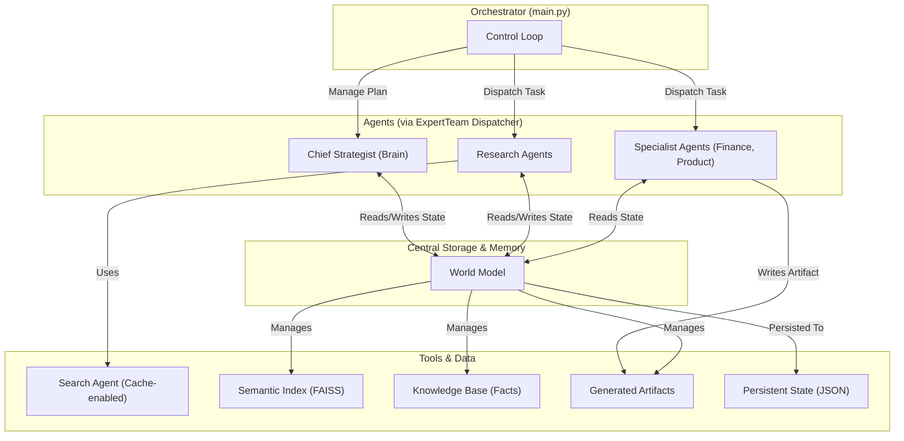

# Автономный Проектный Офис (APO)

## 🎯 Концепция и Цель

Это мульти-агентная автономная система, спроектированная для проведения глубокого исследования и генерации **полного пакета бизнес-артефактов** для запуска нового B2B HR-Tech продукта.

Цель этого проекта — не просто написать код, а создать продукт, который решает реальную бизнес-задачу: **"Подготовить доказуемый, аудируемый и убедительный бизнес-кейс для принятия инвестиционного решения"**.

Система эмулирует работу проектного офиса, состоящего из AI-агентов:
*   **Главный Стратег (Chief Strategist):** "Мозг" операции. Создает долгосрочный план, проводит рефлексию по итогам каждой фазы, используя продвинутый RAG-механизм, и пишет финальные отчеты.
*   **Команда Экспертов (Expert Team):** "Руки" проекта. Работает как диспетчер, направляя задачи либо агентам-исследователям, либо агентам-специалистам.
*   **Агенты-Специалисты:** Узкопрофильные генераторы артефактов (`FinancialModelAgent`, `ProductManagerAgent`) и система самоисцеления (`ProductOwnerAgent`).

## 🏛️ Архитектура Системы

Система построена на модульной, слабо связанной архитектуре, где каждый компонент выполняет свою роль и взаимодействует с другими через центральную "Модель Мира" (`WorldModel`).



### 🧠 Ключевые Архитектурные Решения

#### 1. Конвейер Верификации Знаний (Борьба с "Галлюцинациями")
Фундаментальная проблема любой AI-системы, работающей с фактами — это риск "галлюцинаций". Этот конвейер спроектирован как многоуровневая система защиты, чтобы гарантировать, что каждый факт (Claim), попадающий в финальный отчет, является верифицированным, релевантным и непротиворечивым.

*   **Этап 1: Аудит Источника.** `Gemma` классифицирует каждый URL, присваивая ему коэффициент доверия, который напрямую влияет на итоговую уверенность в факте.
*   **Этап 2: Пакетное Обнаружение Противоречий (NLI).** С помощью семантического индекса (FAISS) для каждого нового факта находятся 5 самых похожих. Затем `Gemini Flash` одним пакетным вызовом проверяет их на логическое противоречие. При конфликте автоматически создается задача для Агента-Арбитра.
*   **Этап 3: Фильтр Коммерческой Релевантности.** Перед генерацией отчетов `Gemini Flash` одним пакетным вызовом отсеивает все факты, не относящиеся к ключевым бизнес-вопросам (ROI, риски, УТП).

#### 2. Взвешенный Multi-Query RAG (Борьба с "Туннельным Зрением")
Передача всей Базы Знаний в LLM гарантированно приводит к переполнению контекста. Простой RAG часто страдает "туннельным зрением", извлекая факты только по одной теме. Наша система использует продвинутый подход:
1.  **Декомпозиция:** `Gemma` преобразует общую мысль Стратега в несколько сфокусированных запросов (рынок, технологии, конкуренты).
2.  **Взвешенный Поиск:** Система выполняет поиск по каждому запросу с разной глубиной (`k=20` для рынка, `k=10` для конкурентов).
3.  **Сборка Контекста:** Стратег получает сбалансированный, релевантный и всегда предсказуемый по размеру срез знаний для принятия решений.

#### 3. Диспетчеризация Специалистов (Переход от Сбора к Генерации)
Система эволюционировала от простого исследователя до генератора бизнес-ценности. `ExpertTeam` работает как диспетчер, который направляет задачи либо на стандартный конвейер верификации (для исследователей), либо на специализированные методы для агентов-специалистов (`FinancialModelAgent`, `ProductManagerAgent`), которые создают новые структурированные артефакты.

### ✨ Ключевые Инженерные Решения

*   **Пакетная Оптимизация:** Все операции, которые могли бы вызвать N+1 запросов (аудит источников, NLI, фильтр релевантности), были переработаны для выполнения эффективными пакетными вызовами, что радикально снижает задержки и стоимость.
*   **Цикл Финальной Валидации:** Сгенерированные отчеты не сохраняются слепо. Они проходят через автоматическую проверку качества (`Gemini Flash`) и, в случае несоответствия, отправляются Стратегу на доработку с конкретной обратной связью.
*   **Система Самоисцеления:** Встроенный Агент-Арбитр (`ProductOwnerAgent`) автономно разрешает конфликты данных, выполняя дополнительный поиск и обновляя статусы фактов, поддерживая Базу Знаний в чистоте.
*   **Персистентность и Возобновляемость:** Все состояние системы, включая Базу Знаний, артефакты и семантический индекс, сохраняется на диск, что позволяет возобновить многочасовую работу после любого сбоя.
*   **Жесткое Дросселирование:** В самом "агрессивном" по количеству запросов месте (NLI-аудит) встроена принудительная задержка, гарантирующая соблюдение лимитов RPM API.

## 🛠️ Технологический Стек

*   **Язык:** Python 3.11+
*   **AI/ML:** LangChain, Google Gemini API (Pro, Flash, Gemma, Embedding), Pydantic
*   **Поиск:** Serper API, Google Custom Search API
*   **Векторный Поиск:** FAISS (faiss-cpu)
*   **Зависимости:** `requests`, `python-dotenv`

## 🚀 Установка и Запуск

### 1. Предварительные требования

*   Python 3.11 или выше.
*   Git.

### 2. Установка

1.  **Клонируйте репозиторий:**
    ```bash
    git clone https://github.com/ваш-аккаунт/b2b-hr-tech-research.git
    cd b2b-hr-tech-research
    ```
2.  **Создайте и активируйте виртуальное окружение:**
    ```bash
    # Для Windows
    python -m venv venv
    .\venv\Scripts\activate

    # Для macOS/Linux
    python3 -m venv venv
    source venv/bin/activate
    ```
3.  **Установите зависимости:**
    ```bash
    pip install -r requirements.txt
    ```

### 3. Настройка API Ключей

1.  **Создайте файл `.env`** в корневой директории проекта.
2.  **Заполните файл `.env`** вашими ключами. При первом запуске система выполнит быструю диагностику и сообщит, если какой-либо из ключей не был найден.
    ```env
    # Ключ для моделей Gemini (Pro, Flash, Gemma, Embedding)
    GOOGLE_API_KEY="AIz..."

    # Ключ для основного поискового API
    SERPER_API_KEY="...ваш ключ..."

    # Ключи для резервного Google Custom Search API
    GOOGLE_SEARCH_API_KEY="AIz..."
    SEARCH_ENGINE_ID="..."
    ```

### 4. Запуск Системы

*   **Для продолжения прерванного исследования (стандартный режим):**
    ```bash
    python main.py
    ```
*   **Для запуска нового исследования с чистого листа:**
    ```bash
    python main.py --fresh-start
    ```

## 📂 Структура Проекта

```
.
├── agents/                 # Модули AI-агентов
│   ├── chief_strategist.py # "Мозг", планировщик, RAG-ядро
│   ├── expert_team.py      # Диспетчер и реализация всех экспертов
│   └── search_agent.py     # Агент для взаимодействия с поисковыми API
├── core/                   # Ядро системы
│   ├── world_model.py      # Центральное персистентное хранилище
│   └── semantic_index.py   # Обертка для векторного индекса FAISS
├── output/                 # Директория для всех артефактов работы
│   ├── cache/              # Кэш поисковых запросов
│   ├── logs/               # Детальные JSON-логи каждой транзакции
│   ├── system_state.json   # "Мозг" системы, полный слепок состояния
│   ├── faiss.index         # Векторный индекс
│   └── *.md                # Финальные бизнес-артефакты
├── utils/                  # Вспомогательные функции
│   └── helpers.py
├── main.py                 # Главный скрипт (Оркестратор)
├── requirements.txt        # Зависимости проекта
└── README.md               # Этот файл
```

## 📜 Финальные Артефакты

По завершении работы система генерирует полный пакет документов для принятия бизнес-решений.

| Артефакт | Создатель | Аудитория | Ценность |
| :--- | :--- | :--- | :--- |
| **`Executive_Summary_For_Director.md`** | `ChiefStrategist` | Руководство | Краткая выжимка (2-3 стр.) с фокусом на ROI, рисках и УТП. |
| **`Extended_Brief_For_PO.md`** | `ChiefStrategist` | Владелец Продукта | Полный аналитический отчет (5-10 стр.), "единый источник правды". |
| **`financial_model_mvp.md`** | `FinancialModelAgent` | Финансовый отдел | Markdown-таблицы со сметой на MVP и прогнозом прибыли. |
| **`product_brief_mvp.md`** | `ProductManagerAgent` | Команда разработки | Детальное описание продукта и готовый бэклог User Stories для MVP. |

## 📈 Возможные Улучшения (Roadmap)

*   **Панель Мониторинга (Dashboard):** Создать простой веб-интерфейс (на Streamlit) для визуализации состояния системы, прогресса выполнения плана и статистики по API-затратам в реальном времени.
*   **Расширение Инструментов Агентов:** Дать агентам возможность не только искать в вебе, но и, например, клонировать Git-репозитории для анализа кода конкурентов или взаимодействовать с API для получения структурированных данных.
*   **Более Глубокая Рефлексия:** Улучшить `_summarize_situation` Стратега, чтобы он мог анализировать не только факты, но и мета-информацию (например, "мы потратили 80% времени на исследование конкурента X, но не нашли ничего важного, стоит ли продолжать?").
