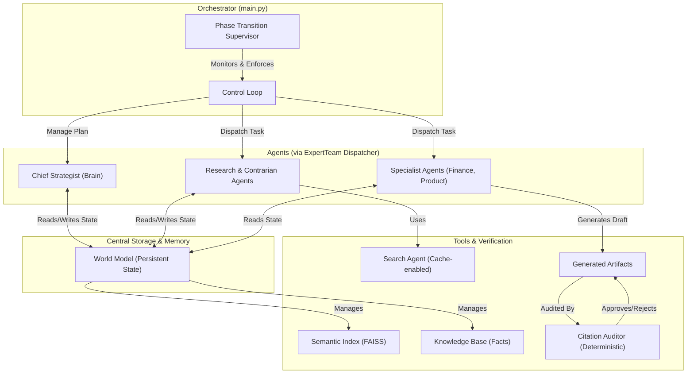

# Автономный Проектный Офис (APO)

## 🎯 Концепция и Цель

Это мульти-агентная автономная система, спроектированная для проведения глубокого исследования и генерации **полного пакета бизнес-артефактов** для запуска нового B2B HR-Tech продукта.

Цель этого проекта — не просто написать код, а создать продукт, который решает реальную бизнес-задачу: **"Подготовить доказуемый, аудируемый и убедительный бизнес-кейс для принятия инвестиционного решения"**.

Система эмулирует работу проектного офиса, состоящего из AI-агентов:
*   **Главный Стратег (Chief Strategist):** "Мозг" операции. Создает долгосрочный план, проводит рефлексию по итогам каждой фазы и пишет финальные отчеты, основанные на жестко отфильтрованном RAG-контексте.
*   **Команда Экспертов (Expert Team):** "Руки" проекта. Диспетчер для агентов-исследователей и агентов-специалистов. Реализует строгий конвейер верификации данных.
*   **Агенты-Специалисты:** Узкопрофильные, строго контролируемые генераторы артефактов (`FinancialModelAgent`, `ProductManagerAgent`) и система разрешения конфликтов (`ProductOwnerAgent`).

## 🏛️ Архитектура Системы: Принцип Нулевого Доверия

Система построена на модульной архитектуре, где каждый компонент работает в рамках **"Принципа Нулевого Доверия"** — мы не доверяем, что какой-либо LLM-компонент выполнит свою задачу корректно без явных ограничений и последующей детерминированной проверки.



### 🧠 Ключевые Архитектурные Решения

#### 1. Многоуровневый Конвейер Верификации (Борьба с Галлюцинациями и Предвзятостью)
Система рассматривает любой факт, сгенерированный LLM, как априори недостоверный. Для получения статуса "VERIFIED" каждый факт проходит через жесткий конвейер:
*   **Этап 1: Аудит Источника.** Дешевая модель (`Gemma`) проводит быструю классификацию URL, присваивая коэффициент доверия.
*   **Этап 2: "Враждебный Аудит".** Другая LLM (`Gemini Flash`) целенаправленно ищет логические уязвимости и слабые места в формулировках факта. Конвейер останавливается, если этот этап проваливается.
*   **Этап 3: Пакетное Обнаружение Противоречий (NLI).** Для каждого нового факта находятся 5 семантически похожих, и `Gemini Flash` проверяет их на логическое противоречие.
*   **Этап 4 (Детерминированный Аудит): Механизм "Контрарного Супервизора".** После завершения каждой исследовательской фазы **Оркестратор** в `main.py` принудительно запускает **Контрарный Аудит**. Он автоматически анализирует Базу Знаний, находит 2-3 самых сильных утверждения и детерминированно создает задачу для `Contrarian_Expert`. Это превращает борьбу с предвзятостью из "пожелания" в неотъемлемую, гарантированную часть процесса верификации.

#### 2. Детерминированный Аудит Цитат (Борьба с Неповиновением Агентов)
Мы не доверяем, что агенты-специалисты (`FinancialModelAgent`, `ProductManagerAgent`) будут следовать инструкциям и основывать свои отчеты на фактах. Поэтому **каждый** сгенерированный ими артефакт проходит через не-AI, детерминированный `CitationValidator`.
*   **Процесс:** Простая Python-функция с помощью регулярных выражений извлекает все цитаты `[Утверждение: claim_id]` из текста.
*   **Проверка:** Она сверяет каждый найденный ID со списком ключей в Базе Знаний.
*   **Вердикт:** Если в артефакте нет цитат, или хотя бы одна цитата ссылается на несуществующий факт, **артефакт бракуется, а задача по его созданию помечается как `FAILED`**. Этот механизм делает невозможной генерацию галлюцинаторных отчетов.

#### 3. Протокол Аварийного Перехода Фазы (Борьба с "Зависанием" Стратега)
Мы не доверяем, что `ChiefStrategist` всегда будет принимать адекватные решения в ходе рефлексии. Если он завершает фазу, но не создает новых задач и не активирует следующую, система может "зависнуть".
*   **Детектор:** Оркестратор в `main.py` обнаруживает этот тупик.
*   **Протокол:** Вместо вызова еще одного LLM, запускается жесткий, детерминированный протокол "Supervisor". Он принудительно меняет статус текущей фазы на `COMPLETED`, находит следующую `PENDING` фазу и активирует ее (`IN_PROGRESS`), позволяя системе продолжить работу без дорогостоящего и непредсказуемого мета-анализа.

### ✨ Ключевые Инженерные Решения

*   **Явное Управление Ресурсами:** Мы отказались от неявного поведения библиотек. `SemanticIndex` теперь использует собственный, полностью контролируемый клиент для работы с Google Embedding API, принудительно устанавливая размерность векторов в `768` для обеспечения эффективности и предсказуемости.
*   **"Контекстный Шлюз Качества":** `ChiefStrategist` не имеет права начинать генерацию финального отчета, если его RAG-механизм не смог собрать минимально необходимое количество релевантных фактов. Это предотвращает бесполезную трату токенов на генерацию из пустоты.
*   **Персистентность и Возобновляемость:** Все состояние системы, включая Базу Знаний, артефакты и семантический индекс, атомарно сохраняется на диск, что позволяет возобновить многочасовую работу после любого сбоя.

## 🛠️ Технологический Стек

*   **Язык:** Python 3.11+
*   **AI/ML:** Google Gemini API (Pro, Flash, Gemma), Pydantic, `google-generativeai` (для прямого контроля эмбеддингов)
*   **Оркестрация и Структурирование:** LangChain (минимально, для парсеров и цепочек вызовов)
*   **Поиск:** Serper API
*   **Векторный Поиск:** FAISS (faiss-cpu)
*   **Зависимости:** `requests`, `python-dotenv`


## 🚀 Установка и Запуск

### 1. Предварительные требования

*   Python 3.11 или выше.
*   Git.

### 2. Установка

1.  **Клонируйте репозиторий:**
    ```bash
    git clone https://github.com/ваш-аккаунт/b2b-hr-tech-research.git
    cd b2b-hr-tech-research
    ```
2.  **Создайте и активируйте виртуальное окружение:**
    ```bash
    # Для Windows
    python -m venv venv
    .\venv\Scripts\activate

    # Для macOS/Linux
    python3 -m venv venv
    source venv/bin/activate
    ```
3.  **Установите зависимости:**
    ```bash
    pip install -r requirements.txt
    ```

### 3. Настройка API Ключей

1.  **Создайте файл `.env`** в корневой директории проекта.
2.  **Заполните файл `.env`** вашими ключами. При первом запуске система выполнит быструю диагностику и сообщит, если какой-либо из ключей не был найден.
    ```env
    # Ключ для моделей Gemini (Pro, Flash, Gemma, Embedding)
    GOOGLE_API_KEY="AIz..."

    # Ключ для основного поискового API
    SERPER_API_KEY="...ваш ключ..."

    # Ключи для резервного Google Custom Search API
    GOOGLE_SEARCH_API_KEY="AIz..."
    SEARCH_ENGINE_ID="..."
    ```

### 4. Запуск Системы

*   **Для продолжения прерванного исследования (стандартный режим):**
    ```bash
    python main.py
    ```
*   **Для запуска нового исследования с чистого листа:**
    ```bash
    python main.py --fresh-start
    ```

## 📂 Структура Проекта

```
.
├── agents/                 # Модули AI-агентов
│   ├── chief_strategist.py # "Мозг", планировщик, RAG-ядро
│   ├── expert_team.py      # Диспетчер и реализация всех экспертов
│   └── search_agent.py     # Агент для взаимодействия с поисковыми API
├── core/                   # Ядро системы
│   ├── world_model.py      # Центральное персистентное хранилище
│   └── semantic_index.py   # Обертка для векторного индекса FAISS
├── output/                 # Директория для всех артефактов работы
│   ├── cache/              # Кэш поисковых запросов
│   ├── logs/               # Детальные JSON-логи каждой транзакции
│   ├── system_state.json   # "Мозг" системы, полный слепок состояния
│   ├── faiss.index         # Векторный индекс
│   └── *.md                # Финальные бизнес-артефакты
├── utils/                  # Вспомогательные функции
│   └── helpers.py
├── main.py                 # Главный скрипт (Оркестратор)
├── requirements.txt        # Зависимости проекта
└── README.md               # Этот файл
```

## 📜 Финальные Артефакты

По завершении работы система генерирует полный пакет документов для принятия бизнес-решений.

| Артефакт | Создатель | Аудитория | Ценность |
| :--- | :--- | :--- | :--- |
| **`Executive_Summary_For_Director.md`** | `ChiefStrategist` | Руководство | Краткая выжимка с фокусом на ROI, рисках и УТП. **Все утверждения подкреплены ссылками.** |
| **`Extended_Brief_For_PO.md`** | `ChiefStrategist` | Владелец Продукта | Полный аналитический отчет. **Все утверждения подкреплены ссылками.** |
| **`financial_model_mvp.md`** | `FinancialModelAgent` | Финансовый отдел | **Аудируемые** Markdown-таблицы. **Все цифры основаны на фактах из Базы Знаний.** |
| **`product_brief_mvp.md`** | `ProductManagerAgent` | Команда разработки | Детальное описание продукта. **Все User Stories основаны на фактах из Базы Знаний.** |
| **`Knowledge_Base_Audit_Report.md`** | `ChiefStrategist` | Все | **"Единый Источник Правды".** Полный, читаемый список всех верифицированных фактов, использованных для генерации отчетов. |


## 📈 Возможные Улучшения (Roadmap)

*   **Панель Мониторинга (Dashboard):** Создать простой веб-интерфейс (на Streamlit) для визуализации состояния системы, прогресса выполнения плана и статистики по API-затратам в реальном времени.
*   **Расширение Инструментов Агентов:** Дать агентам возможность не только искать в вебе, но и, например, клонировать Git-репозитории для анализа кода конкурентов или взаимодействовать с API для получения структурированных данных.
*   **Более Глубокая Рефлексия:** Улучшить `_summarize_situation` Стратега, чтобы он мог анализировать не только факты, но и мета-информацию (например, "мы потратили 80% времени на исследование конкурента X, но не нашли ничего важного, стоит ли продолжать?").
