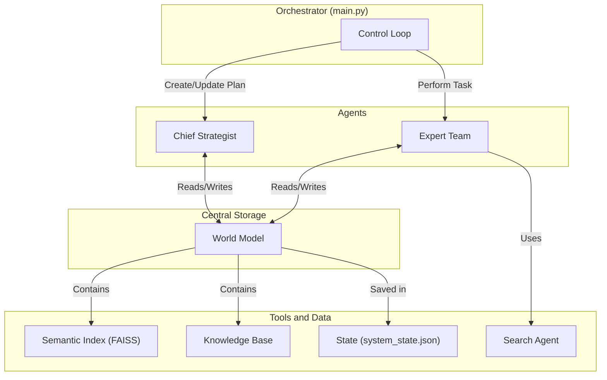

# Автономный Проектный Офис для HR-Tech Исследования

## Краткое Описание

Это мульти-агентная автономная система, спроектированная для проведения глубокого исследования рынка и внутренних активов с целью формирования бизнес-кейса для нового B2B HR-Tech продукта. Проект является демонстрационным артефактом, показывающим компетенции в области AI-инжиниринга, продуктового мышления и построения надежных, масштабируемых систем.

## 🎯 Концепция и Цель

Цель этого проекта — не просто написать код, а создать **продукт**, который решает реальную бизнес-задачу: **"Подготовить  высококачественную, убедительную аналитическую записку с концепцией нового HR-Tech продукта"**.

Система эмулирует работу проектного офиса, состоящего из AI-агентов:
*   **Главный Стратег (Chief Strategist):** "Мозг" операции. Создает долгосрочный план, проводит рефлексию по итогам каждой фазы и пишет финальные отчеты.
*   **Команда Экспертов (Expert Team):** "Руки" проекта. Выполняют конкретные задачи по сбору и верификации информации, используя поисковые системы и внутренние механизмы аудита.


## 🏛️ Архитектура Системы

Система построена на модульной, слабо связанной архитектуре, где каждый компонент выполняет свою роль и взаимодействует с другими через центральную "Модель Мира".



### 🧠 Конвейер Верификации Знаний

Ключевой особенностью системы является многоступенчатый конвейер, который гарантирует высокое качество информации, попадающей в финальные отчеты. Каждый "факт" (Claim) проходит через три этапа:

1.  **Аудит Источника:** С помощью LLM-классификатора определяется тип источника (официальная документация, блог, форум), и каждому факту присваивается начальный "коэффициент доверия".
2.  **Выявление Противоречий:** С помощью **семантического индекса (FAISS)** для каждого нового факта быстро находятся похожие по смыслу утверждения в базе. Затем NLI-модель (Natural Language Inference) проверяет их на прямое противоречие. При обнаружении конфликта система автоматически создает задачу на его разрешение.
3.  **Фильтр Коммерческой Релевантности:** Перед генерацией отчетов Стратег пропускает все факты через набор жестко заданных бизнес-вопросов (о ROI, рисках, конкурентных преимуществах), отсеивая правдивую, но бесполезную для бизнеса информацию.

## ✨ Ключевые Особенности

*   **Взвешенный Multi-Query RAG:** Система не просто извлекает похожие факты. Она декомпозирует задачу на несколько доменов (рынок, технологии, конкуренты) и выполняет взвешенный поиск по каждому, собирая сбалансированный и релевантный контекст для принятия стратегических решений.
*   **Надежный Конвейер Верификации:** Каждый факт проходит через многоступенчатый аудит источника, семантический поиск противоречий (NLI) и фильтр коммерческой релевантности, что минимизирует риск "галлюцинаций".
*   **Пакетная Оптимизация:** Критически важные операции, такие как аудит источников и проверка на противоречия, выполняются эффективными пакетными вызовами, что радикально снижает задержки и стоимость по сравнению с наивным подходом.
*   **Цикл Финальной Валидации:** Сгенерированные отчеты не сохраняются слепо. Они проходят через автоматическую проверку качества и, в случае несоответствия, отправляются на доработку с конкретной обратной связью.
*   **Персистентность и Возобновляемость:** Все состояние системы, включая Базу Знаний и семантический индекс, сохраняется на диск, что позволяет возобновить многочасовую работу после любого сбоя.
*   **Управляемость и Экономичность:** Поддержка запуска с чистого листа (`--fresh-start`) и кэширование поисковых запросов для экономии ресурсов API.

## 🛠️ Технологический Стек

*   **Язык:** Python 3.11+
*   **AI/ML:** LangChain, Google Gemini API (Pro, Flash, Gemma, Embedding), Pydantic
*   **Поиск:** Serper API, Google Custom Search API
*   **Векторный Поиск:** FAISS (faiss-cpu)
*   **Зависимости:** `requests`, `python-dotenv`

## 🚀 Установка и Запуск

### 1. Предварительные требования

*   Python 3.11 или выше.
*   Git.

### 2. Установка

1.  **Клонируйте репозиторий:**
    ```bash
    git clone https://github.com/ваш-аккаунт/b2b-hr-tech-research.git
    cd b2b-hr-tech-research
    ```

2.  **Создайте и активируйте виртуальное окружение:**
    ```bash
    # Для Windows
    python -m venv venv
    .\venv\Scripts\activate

    # Для macOS/Linux
    python3 -m venv venv
    source venv/bin/activate
    ```

3.  **Установите зависимости:**
    ```bash
    pip install -r requirements.txt
    ```

### 3. Настройка API Ключей

1.  **Создайте файл `.env`** в корневой директории проекта, скопировав `.env.example` (если он есть) или создав с нуля.

2.  **Заполните файл `.env`** вашими ключами. Он должен выглядеть так:

    ```env
    # Ключ для моделей Gemini (Pro, Flash, Gemma, Embedding)
    GOOGLE_API_KEY="AIz..."

    # Ключ для основного поискового API
    SERPER_API_KEY="...ваш ключ..."

    # Ключи для резервного Google Custom Search API
    GOOGLE_SEARCH_API_KEY="AIz..."
    SEARCH_ENGINE_ID="..."
    ```

### 4. Запуск Системы

*   **Для продолжения прерванного исследования (стандартный режим):**
    Система автоматически загрузит последнее сохраненное состояние из папки `output`.
    ```bash
    python main.py
    ```

*   **Для запуска нового исследования с чистого листа:**
    Этот флаг удалит все предыдущие результаты (состояние, индекс) и начнет работу с нуля.
    ```bash
    python main.py --fresh-start
    ```

## 📂 Структура Проекта

```
.
├── agents/                 # Модули AI-агентов (Стратег, Команда Экспертов, Поиск)
│   ├── chief_strategist.py
│   └── ...
├── core/                   # Ядро системы (Модель Мира, Семантический Индекс)
│   ├── world_model.py
│   └── semantic_index.py
├── output/                 # Директория для всех артефактов работы
│   ├── cache/              # Кэш поисковых запросов
│   ├── logs/               # Детальные логи транзакций
│   ├── system_state.json   # Персистентное состояние системы
│   ├── faiss.index         # Персистентный векторный индекс
│   └── id_map.json         # Карта ID для индекса
├── utils/                  # Вспомогательные функции (парсеры, хелперы)
│   └── helpers.py
├── main.py                 # Главный скрипт (Оркестратор)
├── requirements.txt        # Зависимости проекта
└── README.md               # Этот файл
```

## 📈 Возможные Улучшения (Roadmap)

*   **Реализация Агента-Арбитра (`ProductOwnerAgent`):** Сейчас система обнаруживает противоречия и создает задачи на их разрешение. Следующий шаг — реализовать логику для агента, который будет выполнять эти задачи: проводить дополнительный поиск для нахождения решающего источника и обновлять статусы конфликтующих утверждений.
*   **Применение RAG для Финальных Отчетов:** Распространить RAG-подход, используемый при рефлексии, на генерацию финальных отчетов, чтобы гарантировать их устойчивость к большим объемам Базы Знаний.
*   **Панель Мониторинга (Dashboard):** Создать простой веб-интерфейс (например, на Streamlit) для визуализации:
    *   Текущего стратегического плана и статуса выполнения задач.
    *   Графа Базы Знаний.
    *   Статистики по API-затратам в реальном времени.
*   **Расширение Команды Экспертов:** Добавить новых специализированных агентов, например, `FinancialModelAgent` для построения детальных финансовых прогнозов в табличном виде или `LegalExpert` для оценки юридических рисков.
```
